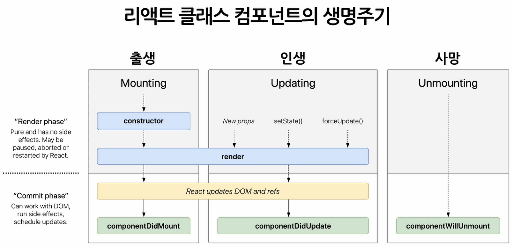

## 색션 6. State and Lifycycle

State는 직접 수정할 수 없다 (가능하지만 하면 안 된다.)  
-> setState 사용

### 리액트 컴포넌트의 생명 주기



> component가 계속 존재하는 것이 아니라, 시간의 흐름에 따라 생성되고 업데이트 되다가 사라진다.

### 실습

1. Notification.jsx 작성

```jsx
import React from "react";

const styles = {
  wrapper: {
    margin: 8,
    padding: 8,
    display: "flex",
    flexDirection: "row",
    border: "1px solid grey",
    borderRadius: 16,
  },
  messageText: {
    color: "black",
    fontSize: 16,
  },
};

class Notification extends React.Component {
  constructor(props) {
    super(props);

    this.state = {};
  }

  componentDidMount() {
    console.log(`${this.props.id} componentDidMount() called.`); //생성
  }
  componentDidUpdate() {
    console.log(`${this.props.id} componentDidUpdate() called.`); //업데이트
  }
  componentDiUnmount() {
    console.log(`${this.props.id} componentDiUnmount() called.`); //사망
  }

  render() {
    return (
      <div style={styles.wrapper}>
        <span style={styles.messageText}>{this.props.message}</span>
      </div>
    );
  }
}
export default Notification;
```

2. NotificationList.jsx 작성

```jsx
import React from "react";
import Notification from "./Notification";

const reserveNoti = [
  {
    id: 1,
    message: "안녕하세요, 오늘일정입니다.",
  },
  {
    id: 2,
    message: "점심시간입니다.",
  },
  {
    id: 3,
    message: "곧 미팅입니다.",
  },
];

var timer;

class NotificationList extends React.Component {
  constructor(props) {
    super(props);

    //초기화
    this.state = {
      notifications: [],
    };
  }

  componentDidMount() {
    const { notifications } = this.state;
    timer = setInterval(() => {
      if (notifications.length < reserveNoti.length) {
        const index = notifications.length;
        notifications.push(reserveNoti[index]);

        //state업데이트
        this.setState({
          notifications: notifications,
        });
      } else {
        this.setState({
          notifications: [],
        });
        clearInterval(timer);
      }
    }, 2000);
  }

  render() {
    return (
      <div>
        {this.state.notifications.map((notifications) => {
          return (
            <Notification
              key={notifications.id} //구분을 위한 id
              id={notifications.id}
              message={notifications.message}
            />
          );
        })}
      </div>
    );
  }
}
export default NotificationList;
```
